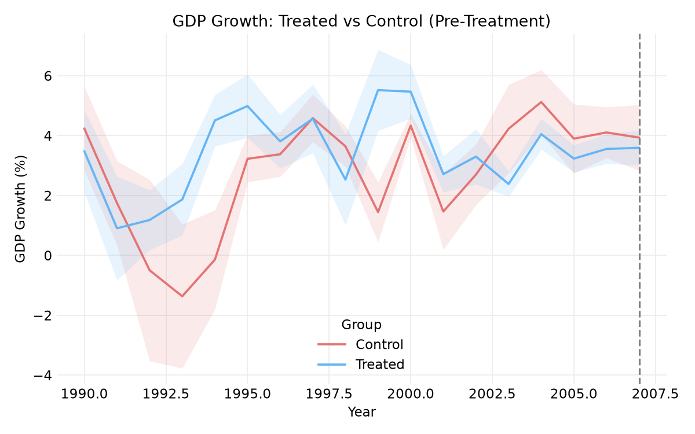
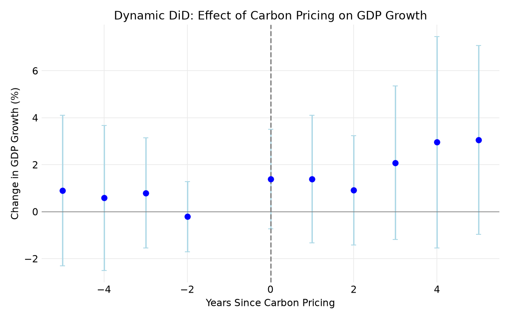
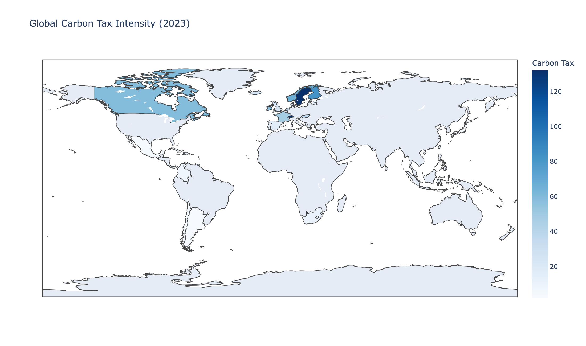
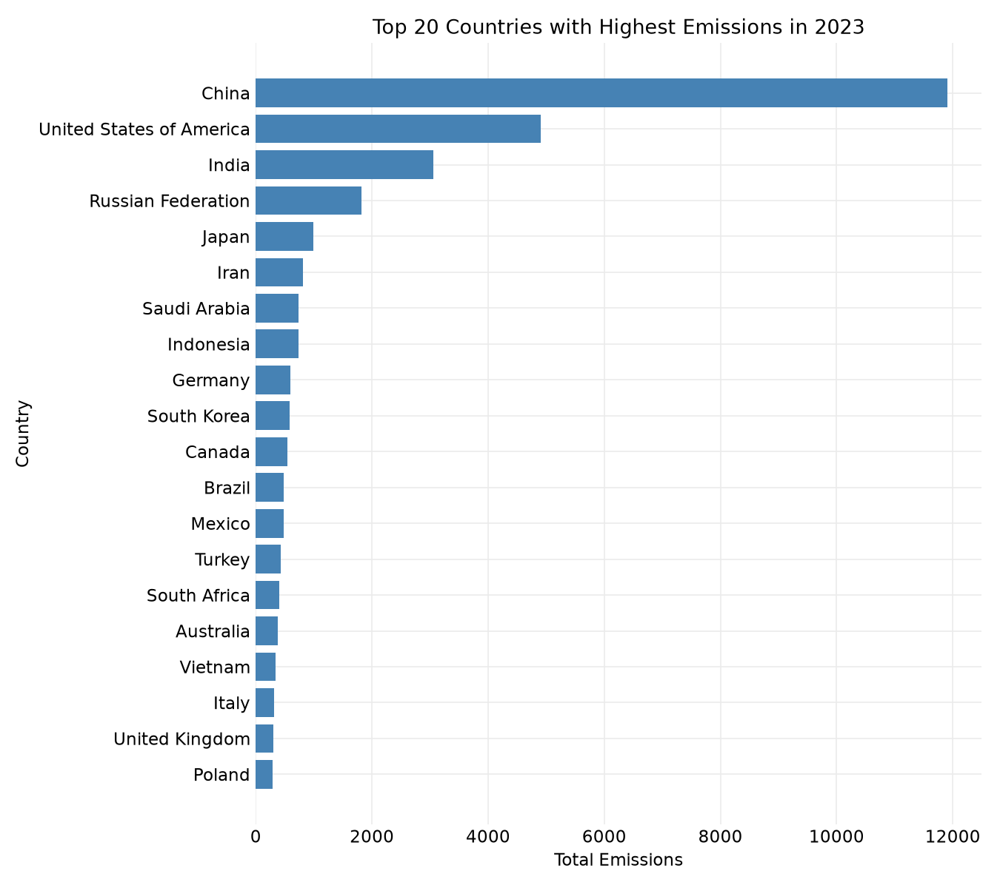

# Carbon Pricing Analysis

Python translation of `draft stats definitivo.Rmd` — a country-panel study
(1990–2024) of carbon tax/ETS adoption, emissions trends, their relationship
to economic indicators, and a difference-in-differences (DiD) estimate of
carbon pricing's effect on GDP growth, inflation, and unemployment across 16
treated/control countries.

📄 The full written thesis (literature review, methodology, discussion) is
linked in the "[The written thesis](#the-written-thesis)" section below.

---

## Key findings

**Carbon pricing shows no significant effect on GDP growth, inflation, or
unemployment in the pooled 16-country DiD model** — every `post` coefficient
is statistically indistinguishable from zero:

| Outcome | Effect (`post`) | p-value | 95% CI |
|---|---|---|---|
| GDP growth | +0.54 pts | 0.63 | [-1.65, 2.73] |
| Inflation | +4.31 pts | 0.19 | [-2.16, 10.79] |
| Unemployment | +0.55 pts | 0.65 | [-1.83, 2.93] |

Splitting the treated group by adoption timing tells a sharper story: **early
adopters** (Finland, Sweden, Ireland, New Zealand — adopted 1990–2010) show a
significant **+3.68 pt** jump in GDP growth after adoption (p = 0.021), while
**late adopters** (France, Canada, Korea, Japan — adopted 2014–2019) show a
non-significant **-1.10 pt** decline (p = 0.13). The event study around
adoption (years -5 to +5) is consistent with this — no single year crosses
significance, but point estimates drift upward from +0.9 pts at adoption to
+3.1 pts five years out.

<p align="center">
  
  
</p>

Robustness checks cut both ways: a **placebo test** (fake pre-adoption
treatment timing) correctly finds no significant fake interaction effect
(p = 0.92), supporting the design. But swapping in EU comparators (Norway,
Denmark, Austria, Poland, Czech Republic, Spain) for the control group flips
the pooled `post` effect to strongly significant (+1.38, p < .0001) — the
null result on GDP growth is sensitive to control-group choice, and this is
reported rather than hidden.

Other notable results:
- **Carbon-pricing countries are richer, not necessarily lower-carbon
  economies**: average carbon tax price correlates strongly with GDP per
  capita (r = 0.81) and with lower inflation (r = -0.59) — pricing is
  concentrated among wealthy, low-inflation economies rather than rolled out
  at random.
- **Adoption has snowballed**: only Finland and Norway (1991) had carbon
  pricing before the mid-1990s; 15 of the 39 priced jurisdictions in the
  sample adopted between 2019 and 2024 alone.
- **Uruguay has the highest average carbon tax price** in the sample
  ($167/tCO2), ahead of Sweden and Switzerland/Liechtenstein (~$132) and
  Finland ($82.5).
- **Global emissions kept climbing**: mean per-country emissions rose from
  ~117 Mt CO2e (2000) to ~172 Mt (2023), a 47% increase, with China (11,903
  Mt), the United States (4,911 Mt), and India (3,062 Mt) the largest
  cumulative emitters by far.

<p align="center">
  
  
</p>

---

## Project structure

```
analysis-code/
├── data/
│   ├── clean data.xlsx                     ← World Bank economic indicators
│   ├── Cleaned_Compliance_Price_Data.csv   ← carbon tax / ETS prices
│   └── Organized_Emissions_Data.csv        ← CO2 emissions by country/year
├── src/
│   ├── config.py                 ← paths, column aliases, colors, ggplot-style theme, DiD country groups
│   ├── preprocessing.py          ← load + merge the 3 datasets into `merged_data`
│   ├── descriptive.py            ← summary stats, missing values, emissions-by-country charts
│   ├── price_trends.py           ← carbon tax/ETS trend, heatmaps, adoption, volatility, distributions
│   ├── mapping.py                ← choropleth maps (carbon tax / ETS intensity)
│   ├── economic_relationships.py ← scatter loop vs. carbon tax, correlation matrix, renewable energy
│   └── did_analysis.py           ← difference-in-differences: parallel trends, TWFE models, event studies, placebo/sensitivity
├── notebooks/
│   ├── 01_data_prep.ipynb
│   ├── 02_emissions_analysis.ipynb
│   ├── 03_carbon_price_trends.ipynb
│   ├── 04_choropleth_maps.ipynb
│   ├── 05_economic_relationships.ipynb
│   └── 06_did_analysis.ipynb
├── outputs/
│   ├── figures/          ← all PNG charts
│   └── tables/            ← all CSV stat tables
└── requirements.txt
```

---

## Methodology

| Analysis | R draft equivalent | Python implementation |
|---|---|---|
| Data merge | `merge()` of 3 raw sources | `src/preprocessing.load_and_merge()` |
| Descriptives, missing values | `summary()`, `colSums(is.na())` | `src/descriptive.py` |
| Emissions trends & top emitters | `ggplot` bar/line charts | `src/descriptive.py` |
| Carbon tax / ETS trends, heatmaps, adoption, volatility | `ggplot` line/heatmap/boxplot charts | `src/price_trends.py` |
| Choropleth maps | `rworldmap` | `src/mapping.py` (see deviation below) |
| Carbon tax vs. economic indicators (scatter + lm) | `geom_point` + `geom_smooth(method="lm")` | `src/economic_relationships.plot_carbon_tax_scatter()` |
| Correlation matrix | `cor(..., use="complete.obs")` | `src/economic_relationships.correlation_matrix()` |
| Parallel trends | `stat_summary(mean, mean_se)` | `src/did_analysis.parallel_trends_stats/plot_parallel_trends()` |
| Two-way fixed effects DiD | `fixest::feols(y ~ ... \| Country + Year, cluster=~Country)` | `src/did_analysis.fit_twfe()` |
| Event study | `i(rel_year, ref=-1)` + `iplot()` | `src/did_analysis.run_event_study/plot_event_study()` |
| Early vs. late adopter interactions | `i(post, early_treated)` + `i(post, late_treated)` | `src/did_analysis.run_early_late_models()` |
| Placebo & sensitivity tests | ad-hoc `feols()` re-runs | `src/did_analysis.run_placebo_test/run_sensitivity_test()` |

**Not in the R draft:**
- 95% CIs reported alongside every DiD coefficient
- Explicit handling of exact-collinear regressors (see below) instead of a
  silent `NA`
- Cross-check of the EU-comparator sensitivity result against the
  full (unrestricted) dataset rather than the already-filtered DiD subset

---

## Setup

```bash
python3 -m venv .venv
source .venv/bin/activate
pip install -r requirements.txt
jupyter notebook notebooks/
```

Each notebook reloads the raw data itself; run in any order except
`06_did_analysis.ipynb`, which is easiest to follow after `01_data_prep.ipynb`.

---

## Visual style

Charts mirror the R draft's `theme_minimal()` ggplot theme: white
background, light grey gridlines (`#EBEBEB`), no axis ticks/spines. Colors
are matched literally to the R code's named colors/hex values
(`"blue"`, `"red"`, `"steelblue"`, `"green"`, the `#E57373`/`#64B5F6`
parallel-trends colors, and ggplot2's default 4-category hue palette
`#F8766D #7CAE00 #00BFC4 #C77CFF` for income groups).

---

## Column naming

The R draft runs `colnames(df) <- make.names(colnames(df))`, which mangles
names like `"GDP (current US$)"` into `GDP..current.US..`. This uses
readable snake_case aliases instead (`gdp`, `gdp_per_capita`, `inflation`,
...) defined in `config.ECON_COLUMN_MAP` — same variables, same
calculations, legible code.

---

## Estimation approach (difference-in-differences)

The R draft uses `fixest::feols(y ~ ... | Country + Year, cluster=~Country)`.
`fixest` defaults to clustering by the first fixed effect whenever fixed
effects are present, so every DiD model here uses country-clustered
standard errors, whether or not the R code passed `cluster=` explicitly.

Two-way fixed effects are estimated as country + year dummy variables
(LSDV) with `statsmodels.OLS` + cluster-robust covariance, rather than
`linearmodels.PanelOLS`'s built-in demeaning: on this unbalanced
16-country panel, PanelOLS's absorption-rank check flags the entire
regressor block as collinear with the fixed effects (a false positive —
manual two-way demeaning confirms `treat_post` retains real variance after
entity+year demeaning). LSDV is algebraically identical to two-way FE
(Frisch-Waugh-Lovell) and isn't affected by that check.

---

## Deliberate deviations from the R draft

A handful of things in the source would have errored, silently misbehaved,
or produced a meaningless result if translated literally. Each is fixed and
documented in code rather than reproduced:

- **`Selected_Country` doesn't exist** (`did_analysis.run_sensitivity_test`):
  the R draft's sensitivity-check chunk filters on `Selected_Country`, a
  column that was never created (only `Country`, already lowercased by that
  point in the script) — this would raise `object 'Selected_Country' not
  found` in R. Fixed to use `country`.
- **EU sensitivity comparators aren't reachable** (same function): by the
  time the R draft reaches this chunk, its `merged_data` variable has
  already been overwritten with the 16-country DiD subset, so the new EU
  comparators (Norway, Denmark, Austria, Poland, Czech Republic, Spain —
  none of which are in that 16-country list) would never actually appear
  even with the `Selected_Country` bug fixed. This rebuilds the comparison
  from the full, unrestricted merged dataset instead, so the check does
  what it was clearly meant to do.
- **`post` and `treat_post` are exactly identical columns**: `post` is 0 for
  every control-country row (their `adoption_year` is always missing), so
  `treated * post` equals `post` wherever both matter. Fitting both in the
  same regression would let OLS split an indeterminate coefficient
  arbitrarily between two identical columns; `did_analysis.fit_twfe` detects
  exact-duplicate regressors and drops the later one, reporting it as `NaN`
  in `coef_table` — matching what `fixest` itself would show (`NA` for the
  redundant term). This is why the headline effect above is read off `post`.
- **`treated`/`early_treated`/`late_treated` are dropped from every
  two-way-FE model**: they're time-invariant per country, so they're
  perfectly collinear with the country fixed effects. `fixest` would report
  `NA` for these too; they're simply excluded from `x_cols` here.
- **Map title says "(2023)" but filters `Year == 2024`**: reproduced
  literally — this mismatch is in the source itself, not a translation
  artifact.
- **`rworldmap` → `plotly` choropleth**: R's `joinCountryData2Map(...,
  joinCode="NAME")` matches countries by name and silently drops/warns about
  any it can't match to a polygon. `mapping.COUNTRY_TO_ISO3` maps the World
  Bank-style country names to ISO-3 codes for a reliable `plotly` match;
  anything not in that dict (e.g. `"European Union"`, not a single country
  polygon) is dropped the same way `joinCountryData2Map` would drop it.
- **Tax volatility spaghetti plot has ~230 countries**: a per-country
  legend of that size is unreadable in any tool, R included. Lines are
  colored by country via a cycling colormap; the legend is omitted rather
  than rendered illegibly.

---

## Data quality note

`Manufacturing, value added (annual % growth)` contains erroneous
trillion-scale values for the United States (should be a small percentage,
like every other country in the sample) — a problem in `clean data.xlsx`
itself, not the analysis code. It produces a near-zero, statistically
meaningless coefficient for that control variable in the DiD regressions;
this is reproduced as-is since the R draft would hit the exact same values
from the exact same source file.

---

## The written thesis

This repository holds the **code**, not the paper itself — the full thesis
write-up (literature review, methodology discussion, and interpretation)
lives separately. Link/DOI to be added once published.
